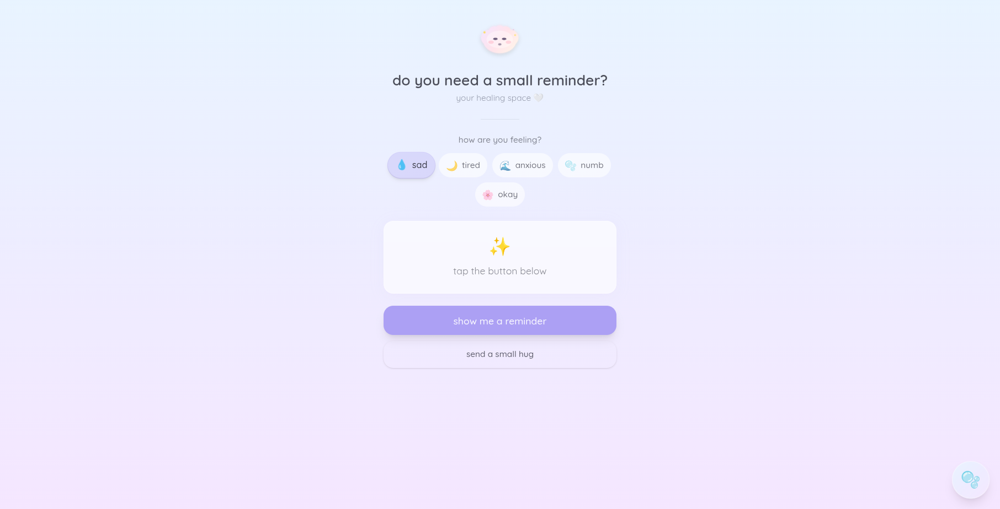

# Do You Need a Small Reminder? 💜

> A cozy emotional support micro-webapp designed to provide comfort and gentle reminders when you're feeling tired, sad, overwhelmed, or anxious.



🌐 **Live Demo:** [doyouneedasmallreminder.app](https://doyouneedasmallreminder.app)

---

## 📖 About

**Do You Need a Small Reminder?** is a mobile-first web application that serves as your personal emotional support companion. In moments when life feels heavy, this app provides:

- Gentle, psychologically-grounded affirmations tailored to your current emotional state
- Interactive features designed to help you relax and let go of stress
- A warm, cozy design that feels like a virtual hug

The app is built with the philosophy that sometimes, we all just need a small reminder that we're okay, that our feelings are valid, and that we matter.

---

## ✨ Features

### 🎭 Mood-Based Reminders

Choose from 5 emotional states (sad, tired, anxious, numb, okay) and receive personalized reminders from our collection of 50+ carefully crafted messages.

### 🫧 Breathing Exercise

A guided breathing bubble with a 4-4-6-2 pattern (inhale-hold-exhale-rest) to help calm your mind and reduce anxiety.

### 🤗 Virtual Hug

Send yourself a warm, animated virtual hug with a full-screen immersive animation.

### ☁️ Cute Mascot

An adorable cloud companion with mood-based expressions that responds to your interactions.

### 📱 Mobile-First Design

Fully responsive design optimized for mobile devices with beautiful pastel gradients and smooth animations.

---

## 🛠️ Tech Stack

| Layer             | Technology                                                                 |
| ----------------- | -------------------------------------------------------------------------- |
| **Runtime**       | [Bun](https://bun.sh)                                                      |
| **Frontend**      | [React](https://react.dev) + [TypeScript](https://www.typescriptlang.org/) |
| **Bundler**       | [Vite](https://vitejs.dev)                                                 |
| **Styling**       | [Tailwind CSS](https://tailwindcss.com)                                    |
| **UI Components** | [shadcn/ui](https://ui.shadcn.com)                                         |
| **Backend**       | [Hono](https://hono.dev)                                                   |
| **Monorepo**      | [Turborepo](https://turbo.build)                                           |

---

## 📁 Project Structure

```
do-you-need-a-small-reminder/
├── client/                    # React frontend application
│   ├── public/                # Static assets (favicon, og-image, etc.)
│   ├── src/
│   │   ├── components/        # React components
│   │   │   ├── BreathingBubble.tsx
│   │   │   ├── HugButton.tsx
│   │   │   ├── Mascot.tsx
│   │   │   ├── MoodSelector.tsx
│   │   │   ├── ParticleBackground.tsx
│   │   │   ├── ReminderCard.tsx
│   │   ├── App.tsx            # Main application component
│   │   ├── index.css          # Global styles & animations
│   │   └── main.tsx           # Entry point
│   └── index.html             # HTML template with SEO meta tags
│
├── server/                    # Hono backend API
│   └── src/
│       └── index.ts           # API endpoints & reminder data
│
├── shared/                    # Shared TypeScript definitions
│   └── src/
│       └── types/
│           └── index.ts       # Type definitions (Mood, Reminder, etc.)
│
├── turbo.json                 # Turborepo configuration
└── package.json               # Root package.json with workspaces
```

---

## 🚀 Getting Started

### Prerequisites

Make sure you have [Bun](https://bun.sh) installed on your machine:

```bash
# Install Bun (macOS, Linux, WSL)
curl -fsSL https://bun.sh/install | bash
```

### Installation

1. **Clone the repository**

```bash
git clone https://github.com/handikatriarlan/do-you-need-a-small-reminder.git
```

2. **Navigate to the project directory**

```bash
cd do-you-need-a-small-reminder
```

3. **Install dependencies**

```bash
bun install
```

### Development

Run the development server:

```bash
bun run dev
```

This will start:

- **Client:** http://localhost:5173
- **Server:** http://localhost:3000

### Build

Create a production build:

```bash
bun run build
```

### Individual Scripts

```bash
# Run only client
bun run dev:client

# Run only server
bun run dev:server

# Build client only
bun run build:client

# Build server only
bun run build:server
```

---

## 🔌 API Endpoints

| Endpoint                      | Method | Description                               |
| ----------------------------- | ------ | ----------------------------------------- |
| `/api/reminder`               | GET    | Get a random reminder from all categories |
| `/api/reminders`              | GET    | Get all reminders with count              |
| `/api/reminders/random`       | GET    | Alias for `/api/reminder`                 |
| `/api/reminders/category/:id` | GET    | Get a random reminder by mood category    |

**Available mood categories:** `sad`, `tired`, `overwhelmed`, `numb`, `okay`

---

## 🎨 Design Philosophy

The app follows an emotionally-sensitive design approach:

- **Color Palette:** Soft pastels (lavender, pink, cream, mint) that feel calming
- **Typography:** Quicksand font for a friendly, approachable feel
- **Animations:** Gentle, smooth animations that don't overwhelm
- **Accessibility:** High contrast text, readable fonts, touch-friendly targets

---

## 🤝 Contributing

Contributions are welcome! Feel free to:

1. Fork the repository
2. Create your feature branch (`git checkout -b feature/amazing-feature`)
3. Commit your changes (`git commit -m 'Add some amazing feature'`)
4. Push to the branch (`git push origin feature/amazing-feature`)
5. Open a Pull Request

---

## 👤 Author

**Arlan Tri Handika**

- Website: [handikatriarlan.dev](https://handikatriarlan.dev)
- GitHub: [@handikatriarlan](https://github.com/handikatriarlan)

---

<p align="center">
  Made with 💜 for everyone who needs a small reminder
</p>
